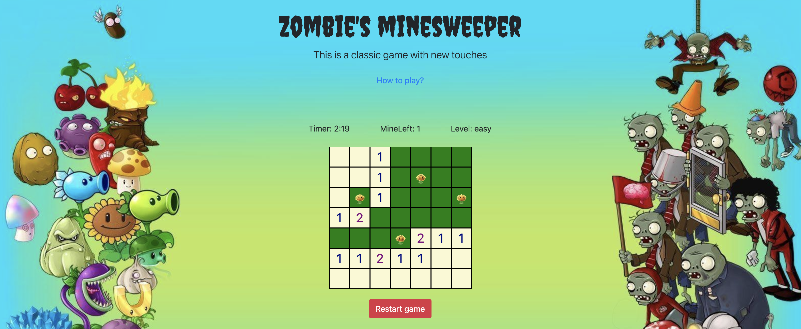
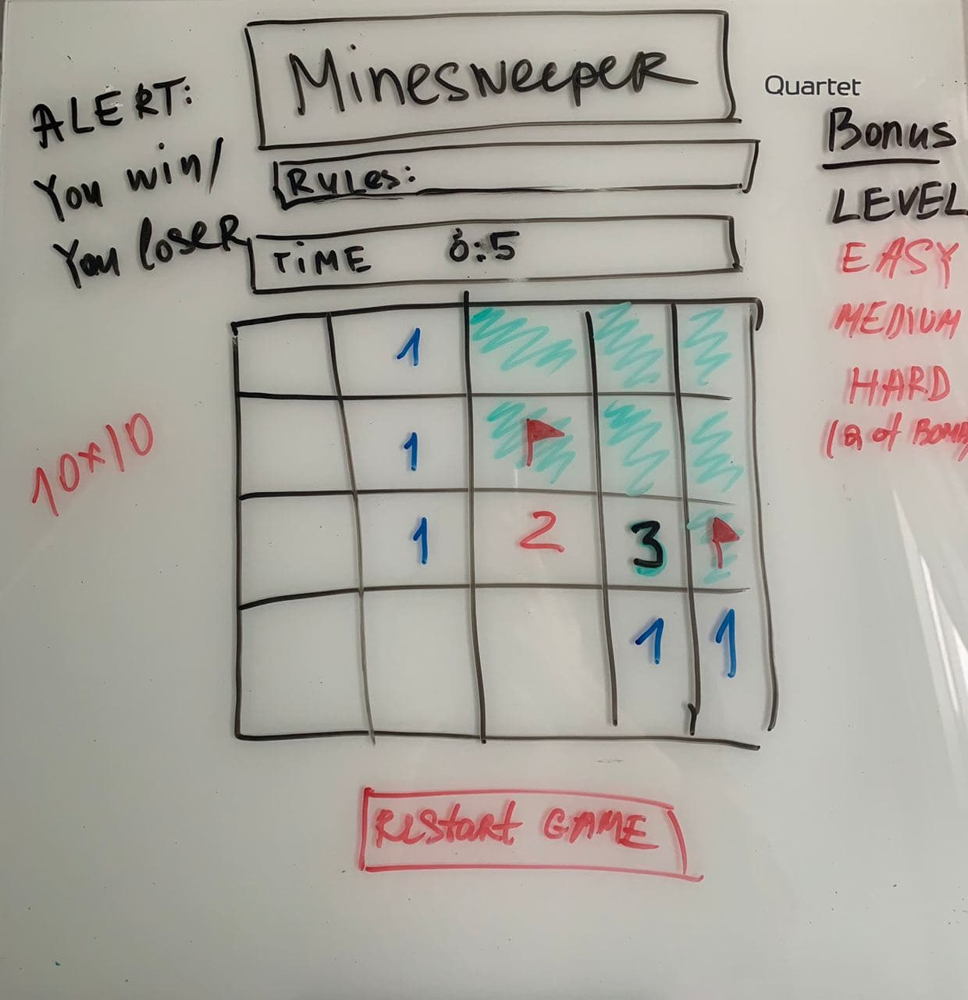
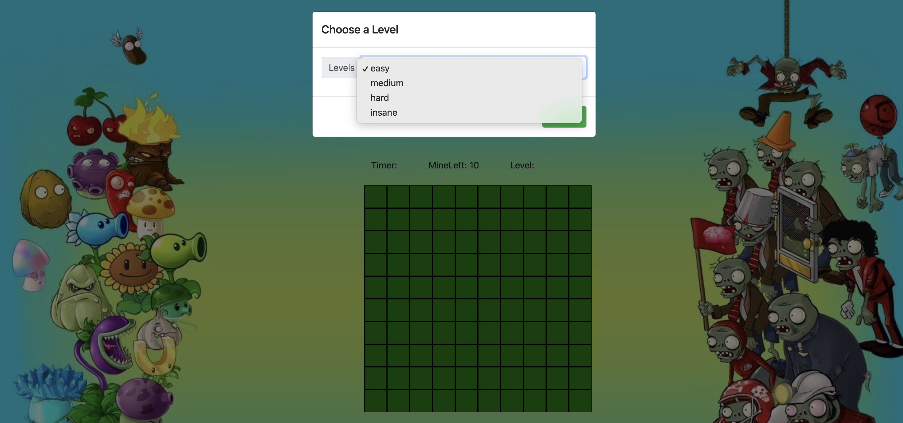
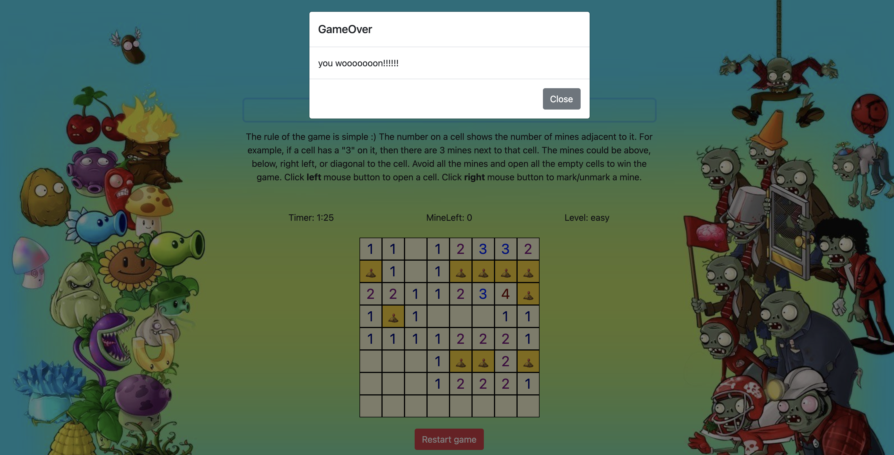
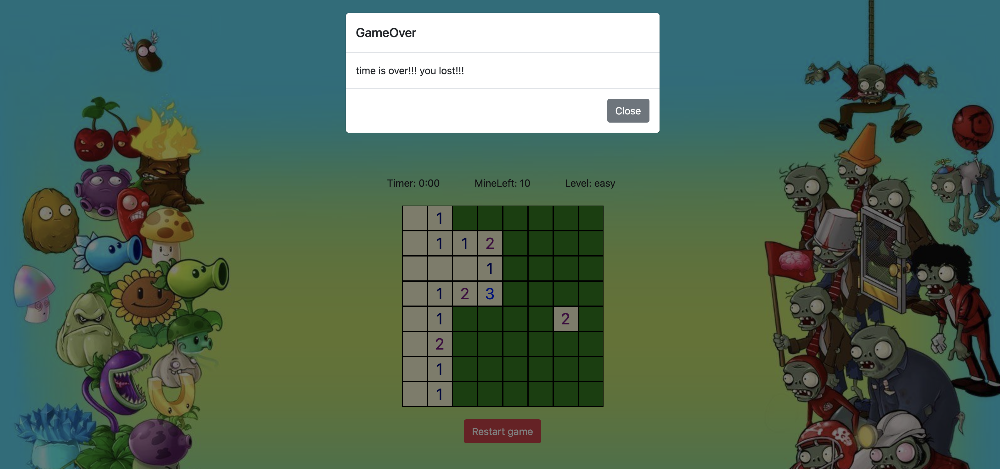
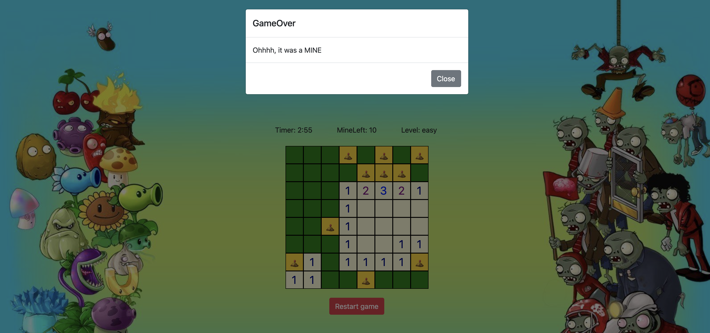

## Project 1   Browser-based Game

# **ZOMBIE'S MINESWEEPER**

1. **About**: This is a classic game with a zombie theme. The game is simple. A player has to open all cells without mines. If the player clicks on mine, the game is over. There are different levels of complexity from easy to insane.
2. **Technologies used**: HTML, CSS, JavaScript, Bootstrap, jQuery
3. **Getting started**: [Play Game](https://annabaranova.github.io/minesweeper_game/)
4. **Wireframe**: 

5. **Screenshots**:

* Choose a game level: 

* Win situation:

* Loss situations:

6. **My biggest challenges**:

> * Write a function that opens empty cells around the clicked one until it reaches cells with numbers.
> * Write a function that adds +1 in cells around a cell with a mine.
> * Set a timer.

7. **My key learnings**:

> * How to build a browser-based game from scratch using the MVC approach,
> * How to use the Bootstrap framework,
> * How to manipulate with DOM elements using jQuery,
> * How to write objects and manipulate with them,
> * How to refactor code,
> * How to use media queries to build a layout for different screen sizes.

8. **Next steps**: 

> * Add extra-lives for the Player so he/she can click up to 3 mines during the Game before gameOver.
> * Generate mines after the first cell was clicked.
> * Turn on/turn off sounds easily with a button.

9. **Pseudocode**: [Pseudocode file](pseudocode.md)