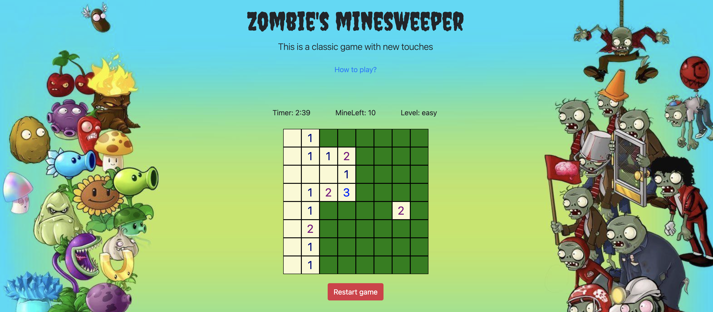

## Project 1   Browser-based Game

# **ZOMBIE'S MINESWEEPER**

1. **Technologies used**: HTML, CSS, JavaScript, Bootstrap, jQuery
2. **Getting started**: [Game link](https://annabaranova.github.io/minesweeper_game/)
3. **Screenshots**:
* Choose a game level: 

* Win situation:

* Loss situations:

4. **My biggest challenges**:

> * Write a function that opens empty cells around the clicked one until it reaches cells with numbers.
> * Write a function that adds +1 in cells around a cell with a mine.
> * Set a timer.

5. **My key learnings**:

> * How to build a browser-based game from scratch using the MVC approach,
> * How to use the Bootstrap library,
> * How to manipulate with DOM elements using jQuery,
> * How to write objects and manipulate with them,
> * How to refactor code,
> * How to use media queries to build a layout for different screen sizes.

6. **Next steps**: 

> * Add extra-lives for the Player so he/she can click up to 3 mines during the Game before gameOver.

7. **Pseudocode**: [Pseudocode file](pseudocode.md)